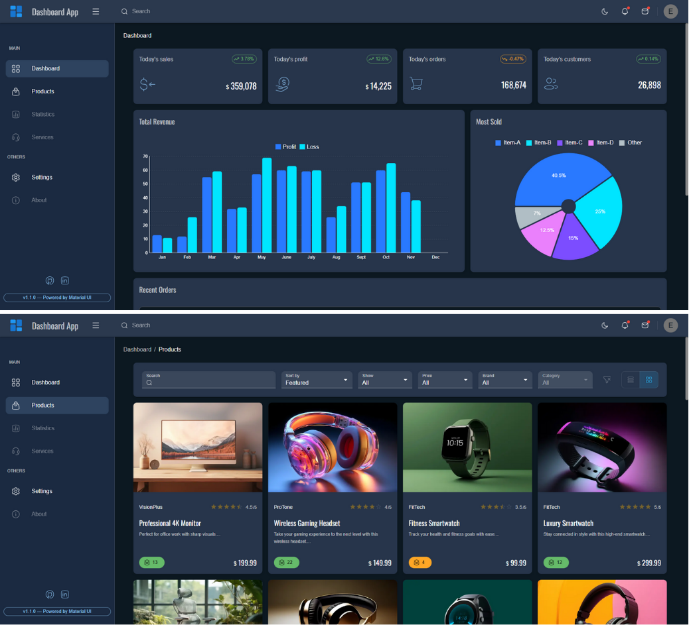

# Dashboard App
A dynamic and modern dashboard application built with Next.js. It includes features like authentication, skeleton placeholders, dynamic routing, and API handling to enhance the user experience. This project leverages the power of Material UI, an awesome library for building fast and visually appealing components.

## Screenshot  
  <!-- Replace with the path to your screenshot image -->

## Features  
- **Authentication and Authorization**: Ensures secure access by using NextAuth.js with support for "Credential" and "GitHub" providers.  
- **Skeleton Placeholder**: Enhances user experience by displaying a placeholder while content is loading.  
- **Color Mode of Theme**: Offers Light, Dark, and System theme modes for personalized appearance preferences.  
- **Static and Dynamic Routes**: Includes pre-defined static and programmatic dynamic routes for navigation.  
- **Route Handlers for API**: Provides backend API routes to retrieve and manage data efficiently.  

## Technologies Used  
- **Next.js**: A powerful React framework for building server-rendered and static web applications.  
- **NextAuth.js**: A robust authentication library for securing user login and authorization.  
- **Material UI**: A modern and customizable component library for React.  
- **X Chart and X Data Grid**: Libraries for implementing data visualization and interactive grids.  
- **Huge Icons (Free Stroke style)**: Icon set providing clear and scalable visuals.  

## Installation  

### Using Create Next App  
To get started with the project locally, follow these steps:  

1. Clone the repository:  
   ```bash  
   git clone https://github.com/EthanEDev/nextjs-dashboard-app.git  
   ```  

2. Navigate to the project directory:  
   ```bash  
   cd nextjs-dashboard-app  
   ```  

3. Install dependencies:  
   ```bash  
   npm install  

   ```  

4. Build production
   
   npm run build

5. Start the development server:  
   ```bash  
   npm start 
   ```  

   Open [http://localhost:3000](http://localhost:3000) in your browser to explore the app.  

## Contributing  
Contributions are welcome! If you have suggestions for improvements or find bugs, please open an issue or submit a pull request.  

1. Fork the repository.  
2. Create a new branch:  
   ```bash  
   git checkout -b feature-branch  
   ```  
3. Commit your changes:  
   ```bash  
   git commit -am 'Add new feature'  
   ```  
4. Push to the branch:  
   ```bash  
   git push origin feature-branch  
   ```  
5. Open a Pull Request.  

# Trigger redeploy


## License  
This project is licensed under the MIT License - see the [LICENSE](./LICENSE) file for details.  

## Contact  
If you have any questions, feel free to reach out to me via GitHub issues or at ethan.ekhtiyar@gmail.com.  
